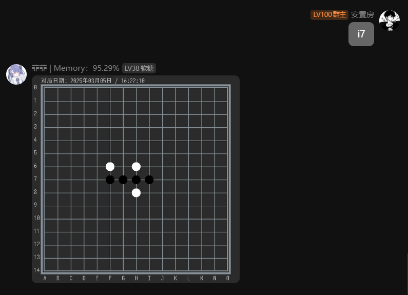

# 基于Mirai的五子棋QQ机器人插件

通过`java.awt.Graphics2D`类实现图片绘制，欢迎大家查看、批评、指正、优化代码

---
插件配置项，在首次运行会抛出`PropertiesFileNotFoundException`异常，
此异常是提醒配置**群聊过滤文件**（防止不该出现的群聊发出消息），异常信息会有指定的路径提示，
当然也可以在mirai主目录下的， config目录下找到`gobang.properties`配置key为`groups`的群聊使用"|"符号可以配置多个群聊。

> 简单来说，首次运行后再退出，根据控制台的报错信息拿到配置文件路径，填写想要启用的群聊使用|分割多群聊

## 机器人指令

没有等级限制，群里面的所有人都可以使用

- 菜单：打印可用命令
- 下棋：通过下棋@QQ进行邀请
- 接受：接受下棋的邀请
- 拒绝：拒绝下棋的邀请
- 认输：认输并结束此局
- 取消：取消发送的邀请

使用棋盘序号 0-14、a-o 匹配格子，大小写兼容，越界不会计算在内

> 有问题联系我(●'◡'●) 2411718391@qq.com
***

